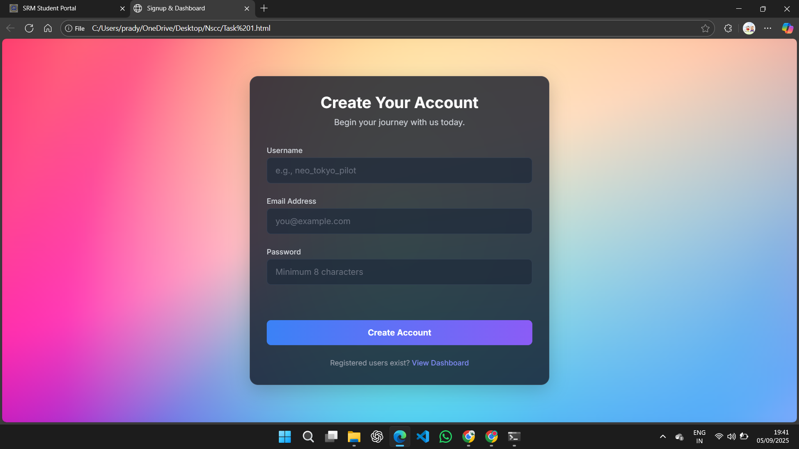

# Task 1 — Signup Form with Validation & Dashboard

## 📖 Overview
This task implements a **Signup Form** where users can register with Username, Email, and Password.  
- Input validation is done on the client-side.  
- Passwords are securely hashed and stored in localStorage.  
- A dashboard displays the registered users in a table format.  
- Bonus: Users can also be deleted from the dashboard.  

---

## 🛠️ Tech Stack
- HTML  
- CSS  
- JavaScript  

---

## 📸 Screenshots
markdown
You can find screenshots here 

---

## 🚀 How to Run
1. Open [Open Task_1.html](./Task_1.html) in your browser.
2. Sign up with test credentials.  
3. View the registered users in the dashboard.
