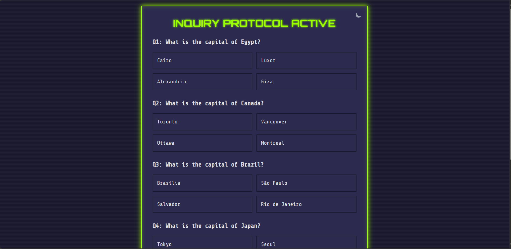

# Task 2 — Quiz Application

## 📖 Overview
This task is a **Quiz Application** built with HTML, CSS, and JavaScript.  
- Displays multiple-choice questions one by one.  
- Tracks the user’s score.  
- Shows the final result after completing all questions.  

---

## 🛠️ Tech Stack
- HTML  
- CSS  
- JavaScript  

---

## 📸 Screenshots
You can find screenshots here

 folder.  

---

## 🚀 How to Run
1. [Open Task_2.html](./Task_2.html) in your browser.  
2. Start the quiz and select answers.  
3. At the end, check your score!
